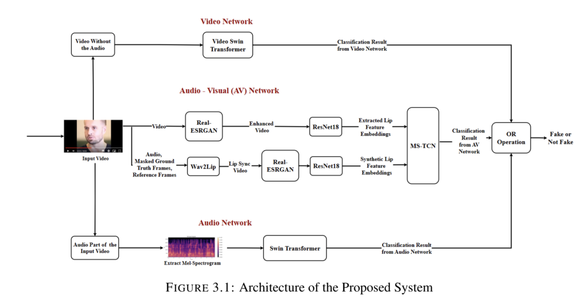

# PoSh - A Multimodal Forgery Detection System

    

## Table of Contents

1. [Introduction](#introduction)
2. [Problem Statement](#problem-statement)
3. [Dataset](#dataset)
4. [Methodology](#methodology)
5. [Results](#results)

## Introduction

Forgery is any form of change introduced to content after its creation. This can include but is not limited to splitting, merging, altering colour channels and altering frequency values. Multi-modal forgery refers to the forgery in more than one modality - speech, visual or audio-visual. **PoSh** is a multimodal forgery detection system designed to identify tampered content. It utilizes advanced algorithms to detect forgeries in audio and video modalities, providing a comprehensive solution to digital forgery.

## Problem Statement

With AI being used for creation of deepfakes, it is essential to have an even stronger and accurate detection system. These deceptive practices erode trust in information sources, deepen societal divisions, and even potentially skew election results in several countries that may significantly alter the political landscape. Social media often deal with content having multiple modalities. With increasing trust in the contents shared and these synthetic creation methods being increasingly sophisticated, the need for robust detection, prevention, and mitigation strategies has become highly significant. Current detection methods are often limited to specific media types and lack the capability to handle multiple modalities simultaneously. **PoSh** aims to fill this gap by providing an integrated system capable of accurately detecting forgeries across both audio and video modalities.

## Dataset

The project uses a publicly available dataset:

- **FakeAVCeleb**: It comprises manipulations in both the audio and video modalities. The dataset is geographically and racially diverse while maintaining gender equality. It is divided into four groups - FakeVideo-FakeAudio (FVFA), RealVideo-FakeAudio (RVFA), FakeVideo-RealAudio (FVRA) and RealVideo-RealAudio (RVRA).It consists of 500 real videos and 19,500 fake videos collected from 500 different subjects.

## Methodology

The proposed architecture consists of three networks viz. - video, audio, and audiovisual. Each branch of the system analyses a part of the input video to produce a classification.
True is produced in the event of the input being Fake and False if it is Not Fake. Finally, the classification results of all three branches are combined using an OR operation. Importantly, the network in which forgery has occurred, whether it be in the audio-only, video-only, or in both modalities, will also be explicitly identified in the output. 

    

The audio branch of the network analyses the audio part, and the video frames are analysed by the video branch. The audio-visual network focuses on synchronising the speech with the lip movement. A completely unaltered audio will be detected as not fake by the audio network, and an unforged video will be classified as not fake by the video network. The audio-visual network is required to detect a combination of an unmodified unrelated audio with an inviolate video.

Lip-sync models are employed to generate video deepfakes. The audio-visual network employs a lip-sync model to generate synthetic lip features and compares the same with actual lip features. The deepfake video generated by the lipsync model will not be detected by the audio-visual framework. To handle such tampering, it is imperative to have an individual video network. Since the lip-sync models do not tamper with audio, a separate audio network is required to deal with the analysis of the audio segment.

## Results

In this proposed system, the audio network has demonstrated remarkable accuracy, achieving an impressive rate of 99.88%. This performance surpasses that of the audio network proposed in existing works, highlighting the effectiveness of our approach in audio forgery detection. Furthermore, the video network, empowered by the Video Swin Transformer, achieves a notable accuracy of 97.09%, outperforming the accuracy attained by video networks in prior studies. The audio-visual branch achieves an accuracy of 92.6%. Consequently, our proposed system as a whole achieves superior accuracy compared to existing methods, underscoring its efficacy in multimodal forgery detection.

